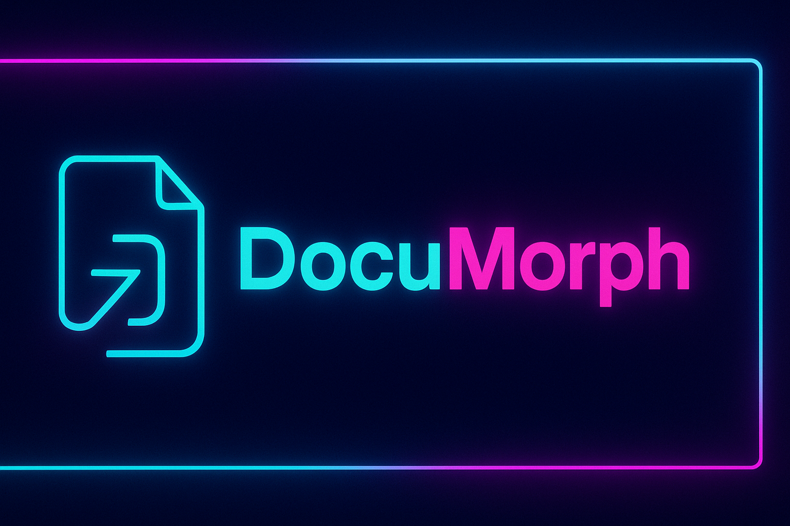

### README.md



**DocuMorph** is a modern, cyberpunk-inspired **Flask web app** designed to handle **PDF, Word, Excel, and image-based documents** with powerful conversion, merging, splitting, and OCR capabilities — similar to **iLovePDF**, but fully customizable.


---

## ✨ Features

✅ **PDF to Word** — Convert PDFs to editable Word documents  
✅ **Word to PDF** — Convert Word files into PDFs  
✅ **Merge & Split PDFs** — Combine or separate PDF pages easily  
✅ **OCR Support** — Extract text from scanned PDFs and images  
✅ **Extract Tables** — Convert PDF tables into Excel format  
✅ **Excel Support** — Read, generate, and modify Excel files  
✅ **Cyberpunk Inspired UI** — Stylish, modern, and responsive design

---

## 🏗️ Project Structure

```
DocuMorph/
├── app.py              # Main Flask app
├── pdf_ops/            # PDF utilities and conversion tools
├── static/             # Frontend assets (JS, logos, cursors)
├── templates/          # HTML templates
├── outputs/            # Converted files (ignored in Git)
├── requirements.txt    # Project dependencies
├── .gitignore          # Ignore unnecessary files
└── README.md           # Project documentation
```

---

## 🛠️ Installation

### 1️⃣ Clone the Repository
```bash
git clone https://github.com/yourusername/DocuMorph.git
cd DocuMorph
```

### 2️⃣ Create a Virtual Environment
```bash
python -m venv venv
source venv/bin/activate   # On Windows: venv\\Scripts\\activate
```

### 3️⃣ Install Dependencies
```bash
pip install -r requirements.txt
```

### 4️⃣ Set Environment Variables
Create a **.env** file in the root folder:
```
FLASK_APP=app.py
FLASK_ENV=development
SECRET_KEY=your_secret_key
```

### 5️⃣ Run the App
```bash
flask run
```

Open **http://127.0.0.1:5000** in your browser.

---

## 🌐 Deployment Guide

### **Heroku**
```bash
# Install Heroku CLI
curl https://cli-assets.heroku.com/install.sh | sh

# Login to Heroku
heroku login

# Create Heroku App
heroku create documorph-app

# Deploy
git push heroku main

# Open App
heroku open
```

### **Gunicorn (Production WSGI Server)**
```bash
gunicorn -w 4 app:app
```

---

## 📦 Tech Stack

- **Backend**: Flask (Python)
- **Frontend**: HTML, CSS, JavaScript
- **Document Tools**:
  - PyPDF2, pdf2docx, python-docx, PyMuPDF, camelot-py
  - Pillow, pytesseract, openpyxl

---

## 🤝 Contributing

Pull requests are welcome! For major changes:
1. Fork the repo
2. Create a new branch (`feature/new-feature`)
3. Commit your changes
4. Push to the branch
5. Open a Pull Request

---

## 📜 License

This project is licensed under the **MIT License** — feel free to use, modify, and distribute.

